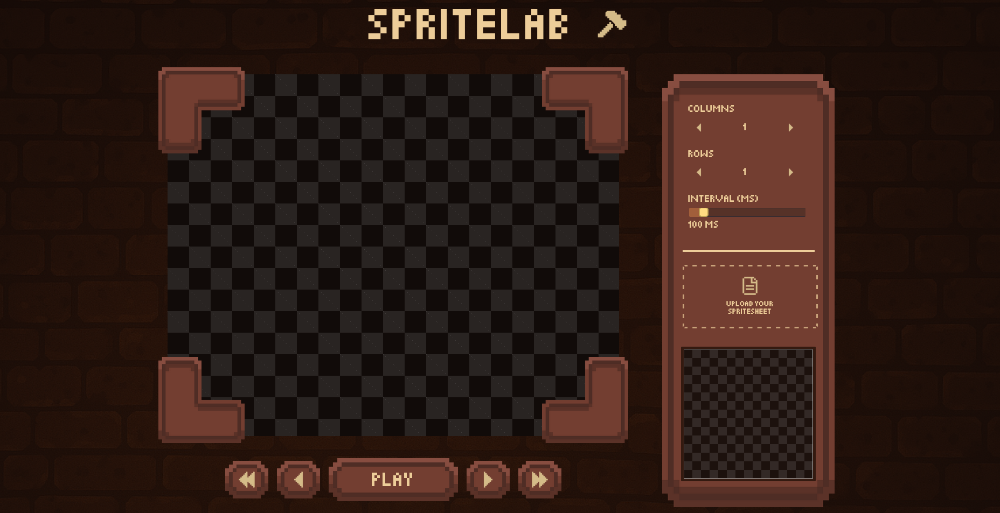
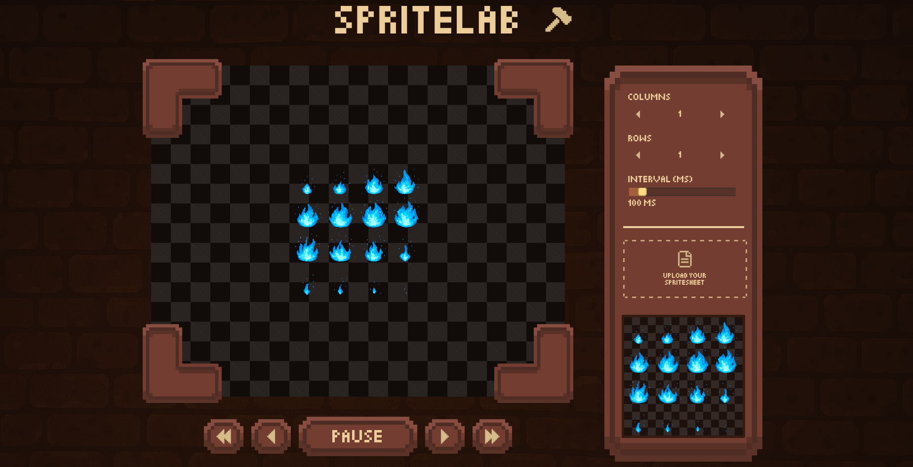

# Spritelab

Spritelab is a web application designed to help users preview and control sprite animations. It allows users to upload sprite sheets, adjust animation settings, and preview animations frame by frame or in a continuous loop.

[Click here for the live Preview](https://www.aliben.me/Spritelab/)

## Previews





## Helpful Hints

If you're interested in creating sprite sheets using AI, I made a GPT that generates optimized prompts for producing images tailored for sprite animations.
[Click here to generate a prompt](https://chatgpt.com/g/g-67f899f660d081918b9fc651f4318e44-spritesheet-prompt-master)

## Features

- **Sprite Sheet Upload**: Upload your sprite sheet in image format.
- **Animation Controls**:
  - Adjust the number of columns and rows in the sprite sheet.
  - Set the animation interval (speed) in milliseconds.
  - Play, pause, and navigate through frames (first, previous, next, last).
- **Live Preview**: View the animation in real-time on a canvas.

## Technologies Used

- **Frontend**: React (with TypeScript)
- **Build Tool**: Vite
- **Styling**: CSS
- **Art**: Aseprite

## How to Use

1. Clone the repository:

   ```bash
   git clone https://github.com/ben4ali/Spritelab.git
   cd SpriteLab
   ```

2. Install dependencies:

    ```bash
    npm install
    ```

3. Start the development server:

    ```bash
    npm run dev
    ```

4. Open your browser and navigate to the provided local development URL (e.g., `http://localhost:5713`).

5. Upload your sprite sheet and experiment with the animation controls to preview your sprite animations.
